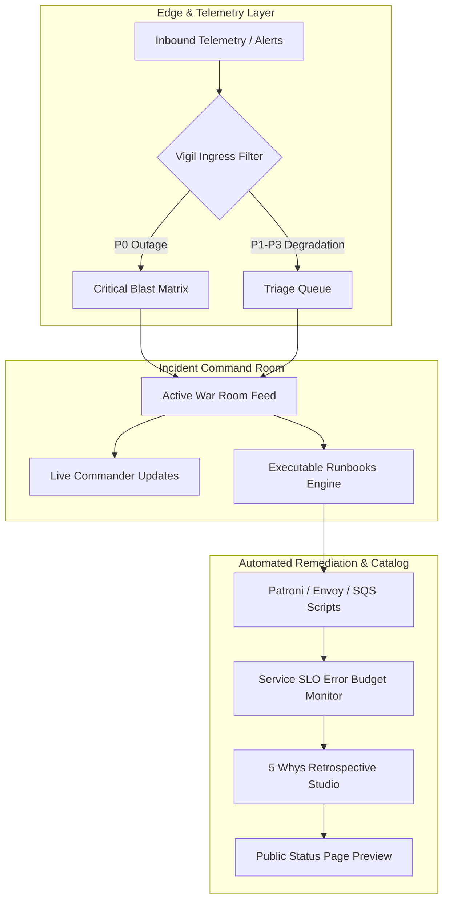

<div align="center">

# Vigil

### Incident Command & Service Reliability Engine

**A keyboard-driven site reliability and incident response platform reverse-engineered from the design philosophy and interaction mechanics of Linear.**

[](https://bun.sh)
[](https://react.dev)
[](https://linear.app)
[]()
[]()

<br />

[Explore App](#core-capabilities) • [Architecture](#architecture) • [Engineering Highlights](#design-engineering--interaction-design) • [Quick Start](#quick-start)

<br />

</div>

---

## The Thesis

When production goes down at 3:00 AM, engineers do not have time to navigate bloated web dashboards, wait for sluggish single-page apps to hydrate, or manually correlate broken services across disparate tools.

**Vigil** treats incident management as a low-latency command terminal. Every interaction, from declaring a P0 outage to draining upstream Envoy proxies and generating 5 Whys retrospectives, is designed to happen with zero cognitive friction and instantaneous keyboard execution.

---

## Core Capabilities

### 1. Zero-Latency Incident Command Matrix
- **P0 to P3 Severity Triage**: Instantaneous visual severity indicators with pulsing critical alert nodes and blast radius impact assessment.
- **Dual View Layouts**: Seamless toggle between a high-density, keyboard-scrollable List View and a Kanban Board view with real-time phase swimlanes (`Investigating`, `Identified`, `Monitoring`, `Resolved`).
- **Interactive Command Room**: Dedicated war room drawer featuring chronological telemetry feeds, one-click video huddle joins, Slack channel deep-links, and live update broadcasting.

### 2. Executable Operational Runbooks
- **Deterministic Workflows**: Interactive, verified procedures for critical failure modes (e.g. Envoy connection pool drain, Patroni PostgreSQL replica failover, and Stripe webhook dead-letter queue replay).
- **One-Click Command Dispatch**: Syntax-highlighted CLI terminal blocks with one-click clipboard copying and live execution progress tracking.

### 3. Service Reliability & SLO Error Budget Catalog
- **Fleet Dependency Mapping**: Live catalog of critical tier-1 and tier-2 services with automated error budget calculation.
- **Microsecond Telemetry**: Real-time p99 latency monitoring compared against established baselines, paired with designated on-call engineer routing.

### 4. Automated Post-Mortem Studio
- **5 Whys Root Cause Investigation**: Hierarchical causal chaining that traces low-level symptoms down to foundational architectural and testing gaps.
- **Tracked Action Items**: Preventative task checklists with assignees and priority weightings.
- **One-Click Markdown Export**: Formats complete retrospective documentation directly into engineering-ready Markdown for pull requests and wikis.

### 5. Public Status Dashboard Preview
- **Customer Transparency**: Production status overview with 90-day historical reliability grids, active public incident notices, and email subscriber notifications.

### 6. Universal Command Palette (`⌘K` / `Ctrl+K`)
- **Global Keyboard Navigation**: Jump to any view, search across incidents, execute runbooks, and declare alerts without touching your mouse.

---

## Architecture



---

## Design Engineering & Interaction Design

### The Linear Aesthetic
Vigil adopts the visual and ergonomic standards of Linear's design system:
- **Obsidian Dark Palette**: Built on deep base tones (`#08090a`, `#000212`) that reduce eye fatigue during high-stress operational incidents.
- **Edge Shines and Radial Ambient Glows**: Subtly illuminates focal components with razor-thin borders (`rgba(255, 255, 255, 0.08)`) and radial purple accents (`rgba(94, 106, 210, 0.15)`).
- **Accessible Typography**: High-contrast typography utilizing Inter paired with SF Mono for cryptographic hashes, IDs, and terminal commands.
- **Mobile First Responsiveness**: Adapts dynamically down to 375px mobile screens with a dedicated bottom tab navigation bar and comfortable 44px tap targets.

### Performance Benchmarks
- **Cold Bundle Size**: `~540 KB` minified JavaScript, `14 KB` CSS.
- **Build Duration**: `< 500 ms` via Bun native bundler.
- **Runtime Dependencies**: Zero heavy third-party UI component libraries; hand-crafted for sub-millisecond DOM responsiveness.

---

## Tech Stack

| Component | Technology | Rationale |
| :--- | :--- | :--- |
| **Runtime & Bundler** | [Bun](https://bun.sh) v1.4 | Sub-second builds, unified ESM tooling, and native static file serving. |
| **UI Framework** | [React 19](https://react.dev) | Modern concurrent rendering, clean state primitives, and predictable hooks. |
| **Icons** | [Lucide React](https://lucide.dev) | Crisp, uniform iconography matching modern developer tools. |
| **Styling** | Custom Pure CSS Tokens | Zero runtime CSS-in-JS overhead, hardware-accelerated animations. |
| **Visual Systems** | Bespoke Pure SVG Architecture | Zero-raster telemetry waveforms, real-time animated service mesh graphs, and vector iconography. |

---

## Quick Start

### 1. Clone & Install

```bash
git clone https://github.com/unveiledhistory49/vigil.git
cd vigil
bun install
```

### 2. Build Production Bundle

```bash
bun run build
```

This compiles React JSX, bundles and minifies CSS and JavaScript into `./dist`, and synchronizes public assets.

### 3. Run Locally

```bash
bun run start
```

Open [http://localhost:3000](http://localhost:3000) in your browser.

---

## Keyboard Shortcuts

| Shortcut | Action | Scope |
| :--- | :--- | :--- |
| <kbd>⌘</kbd> + <kbd>K</kbd> or <kbd>Ctrl</kbd> + <kbd>K</kbd> | Toggle Command Palette | Global |
| <kbd>C</kbd> | Declare New Incident Modal | Global |
| <kbd>Esc</kbd> | Close Active Modal / Palette | Global |
| <kbd>G</kbd> + <kbd>I</kbd> | Jump to Incidents Matrix | Command Palette |
| <kbd>G</kbd> + <kbd>S</kbd> | Jump to Service Catalog & SLOs | Command Palette |
| <kbd>G</kbd> + <kbd>R</kbd> | Jump to Executable Runbooks | Command Palette |
| <kbd>G</kbd> + <kbd>P</kbd> | Jump to Post-Mortem Studio | Command Palette |
| <kbd>G</kbd> + <kbd>T</kbd> | Jump to Public Status Page | Command Palette |
| <kbd>G</kbd> + <kbd>L</kbd> | Switch to Marketing Landing Page | Command Palette |

---

## Quality & Craftsmanship Standards

This codebase was developed following rigorous craftsmanship guidelines:
- **No AI Slop Copywriting**: Natural, specific engineering terminology with zero generic buzzwords.
- **Zero Typographical Defects**: Strict exclusion of em dash characters in UI prose.
- **Full Form Accessibility**: Every input, select, and textarea includes linked HTML labels and explicit ARIA descriptors.
- **Zero Console Errors**: Verified in headless Chromium with clean network logs and asset delivery.

---

<div align="center">

Crafted with precision for infrastructure resilience.

</div>
